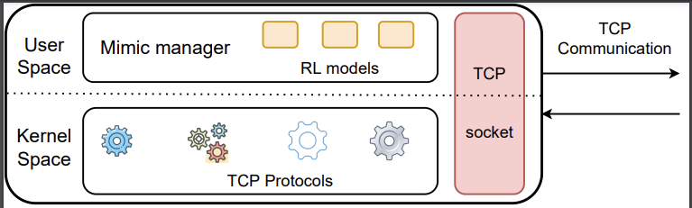

[](https://github.com/Principe92/mimic/actions/workflows/kernel.yml)

# Introduction

MIMIC is a Machine Learning powered congestion control protocol. Using a pool of trained reinforcement learning models, it selects at each time instance the best protocol to handle congestion at the kernel level.

# Architecture


# Algorithm


# Set up

Follow the steps below to get started

### 1. Install dependencies

Run the following command to install required modules
```bash
~/mimic$ sh scripts/setup.sh
```

Make sure you have the latest pip version. Install the following requirements.
```bash
~/mimic$ cd src
~/mimic/src$ source venv/bin/activate
(venv) ~/src$ pip3 install --upgrade setuptools pip
(venv) ~/src$ pip3 install -r requirements.txt
```


### 2. Build kernel module

Open a new terminal and run the following bash scripts from the root of the project to build and install the kernel. This will also set _mimic_ as the default congestion avoidance protocol
```bash
~/mimic$ sh scripts/init_kernel.sh
```

# Train

### 1. Start iperf3 server

Start an _iperf3_ server on another Linux machine by running the following command. Take note of their **_IP_**. You can get the device's _IP_ using the _ifconfig_ command
```bash
$ iperf3 -s
```


## 2. Start training

Run the following command to start training from zero. Check models.yml for the list of possible models
```bash
(venv) ~/mimic/src$ python3 ml/train.py [--all | --models= <owl> ...] [--trace="<name>"] [--retrain=False]
```

Run the following command to retrain latest model. Check models.yml for the list of possible models
```bash
(venv) ~/mimic/src$ python3 ml/train.py [--all | --models= <owl> ...] [--trace="<name>"] [--retrain=True]
```

# Test

Run the following command to test. Check models.yml for the list of possible models
```bash
(venv) ~/mimic/src$ python3 ml/test.py [--all | --models= <owl> ...] [--trace="<name>"]
```

# Collect

Run the following command to collect traces for native protocols. Check models.yml for the list of possible protocols
```bash
(venv) ~/mimic/src$ python3 ml/collect.py [--all | --protocols= <cubic> <owl> ...] [--trace="<name>"] [--logsize=1000]
```

# Predict

Run the following command to start production prediction. Check models.yml for the list of possible models
```bash
(venv) ~/mimic/src$ python3 ml/predict.py [--all | --models= <owl> ...] [--trace="<name>"]
```

# Harm Analysis

Run the following command to start harm analysis using cubic.
```bash
(venv) ~/mimic/src$ python3 ml/harm.py [--solo | --against] [--trace="<name>"]
```

### Run configuration (OPTIONS)

Run the following to see a list of all the available options 
```bash
(venv) ~/mimic/src$ python3 ml/predict.py -h
(venv) ~/mimic/src$ python3 ml/train.py -h
(venv) ~/mimic/src$ python3 ml/test.py -h
(venv) ~/mimic/src$ python3 ml/collect.py -h
```

### Pantheon Testing

Some pantheon testing and analysis commands
```bash
$ src/experiments/test.py local --all -f=20 --data-dir='/home/pokorie/Documents/repos/mimic/log/pantheon/att.lte.driving' --uplink-trace='/home/pokorie/Documents/repos/mimic/traces/ATT-LTE-driving.up' --downlink-trace='/home/pokorie/Documents/repos/mimic/traces/ATT-LTE-driving.down'
$ src/experiments/test.py local --all -f=1 -t=600 --data-dir='/home/pokorie/Documents/repos/mimic/log/pantheon/att.lte.driving.2016' --uplink-trace='/home/pokorie/Documents/repos/mimic/traces/ATT-LTE-driving-2016.up' --downlink-trace='/home/pokorie/Documents/repos/mimic/traces/ATT-LTE-driving-2016.down'
$ src/experiments/test.py local --all -f=1 -t=600 --data-dir='/home/pokorie/Documents/repos/mimic/log/pantheon/tm.lte.driving' --uplink-trace='/home/pokorie/Documents/repos/mimic/traces/TMobile-LTE-driving.up' --downlink-trace='/home/pokorie/Documents/repos/mimic/traces/TMobile-LTE-driving.down '
$ src/experiments/test.py local --all -f=1 -t=600 --data-dir='/home/pokorie/Documents/repos/mimic/log/pantheon/tm.lte.short' --uplink-trace='/home/pokorie/Documents/repos/mimic/traces/TMobile-LTE-short.up' --downlink-trace='/home/pokorie/Documents/repos/mimic/traces/TMobile-LTE-short.down'
$ src/experiments/test.py local --all -f=1 -t=600 --data-dir='/home/pokorie/Documents/repos/mimic/log/pantheon/tm.umts.driving' --uplink-trace='/home/pokorie/Documents/repos/mimic/traces/TMobile-UMTS-driving.up' --downlink-trace='/home/pokorie/Documents/repos/mimic/traces/TMobile-UMTS-driving.down'
$ src/experiments/test.py local --all -f=1 -t=600 --data-dir='/home/pokorie/Documents/repos/mimic/log/pantheon/vz.evdo.driving' --uplink-trace='/home/pokorie/Documents/repos/mimic/traces/Verizon-EVDO-driving.up' --downlink-trace='/home/pokorie/Documents/repos/mimic/traces/Verizon-EVDO-driving.down'
$ src/experiments/test.py local --all -f=1 -t=600 --data-dir='/home/pokorie/Documents/repos/mimic/log/pantheon/vz.lte.driving' --uplink-trace='/home/pokorie/Documents/repos/mimic/traces/Verizon-LTE-driving.up' --downlink-trace='/home/pokorie/Documents/repos/mimic/traces/Verizon-LTE-driving.down' 
$ src/experiments/test.py local --all -f=1 -t=600 --data-dir='/home/pokorie/Documents/repos/mimic/log/pantheon/vz.lte.short' --uplink-trace='/home/pokorie/Documents/repos/mimic/traces/Verizon-LTE-short.up' --downlink-trace='/home/pokorie/Documents/repos/mimic/traces/Verizon-LTE-short.down' 
```

### Pantheon Analysis

Some pantheon analysis commands
```bash
$ src/analysis/analyze.py --data-dir='/home/pokorie/Documents/repos/mimic/log/pantheon/att.lte.driving'
$ src/analysis/analyze.py --data-dir='/home/pokorie/Documents/repos/mimic/log/pantheon/att.lte.driving.2016'
$ src/analysis/analyze.py --data-dir='/home/pokorie/Documents/repos/mimic/log/pantheon/tm.lte.driving'
$ src/analysis/analyze.py --data-dir='/home/pokorie/Documents/repos/mimic/log/pantheon/tm.lte.short'
$ src/analysis/analyze.py --data-dir='/home/pokorie/Documents/repos/mimic/log/pantheon/tm.umts.driving'
$ src/analysis/analyze.py --data-dir='/home/pokorie/Documents/repos/mimic/log/pantheon/vz.evdo.driving'
$ src/analysis/analyze.py --data-dir='/home/pokorie/Documents/repos/mimic/log/pantheon/vz.lte.driving'
$ src/analysis/analyze.py --data-dir='/home/pokorie/Documents/repos/mimic/log/pantheon/vz.lte.short'
$ src/analysis/analyze.py --data-dir='/home/pokorie/Documents/repos/mimic/log/pantheon/wired'
$ src/analysis/analyze.py --data-dir='/home/pokorie/Documents/repos/mimic/log/pantheon/bus'
$ src/analysis/analyze.py --data-dir='/home/pokorie/Documents/repos/mimic/log/pantheon/timessquare'

